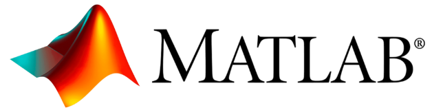
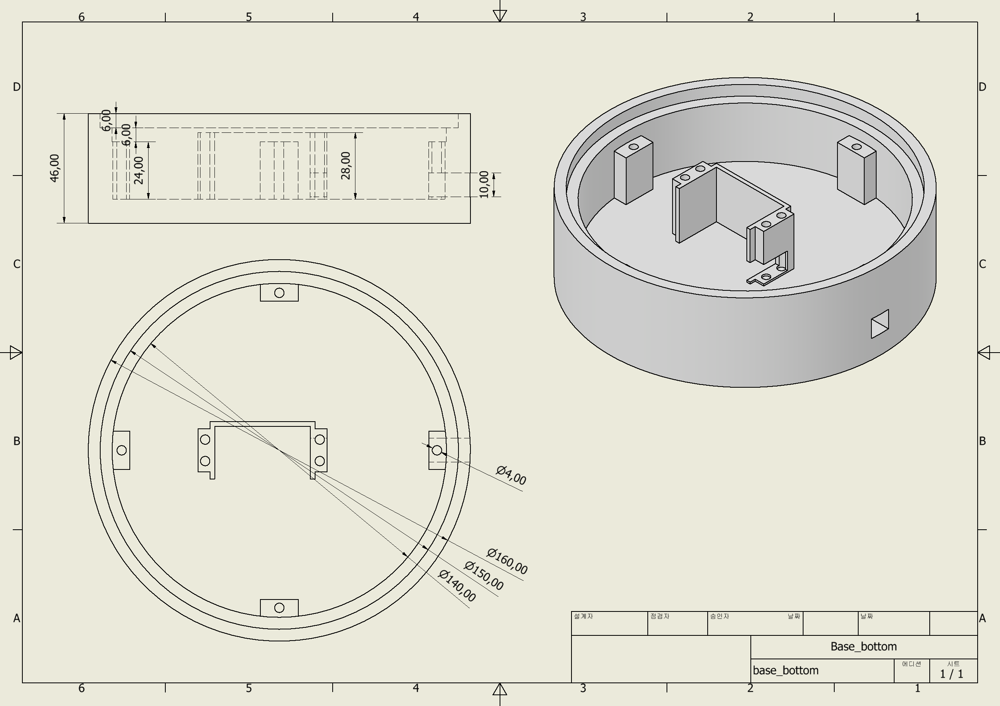
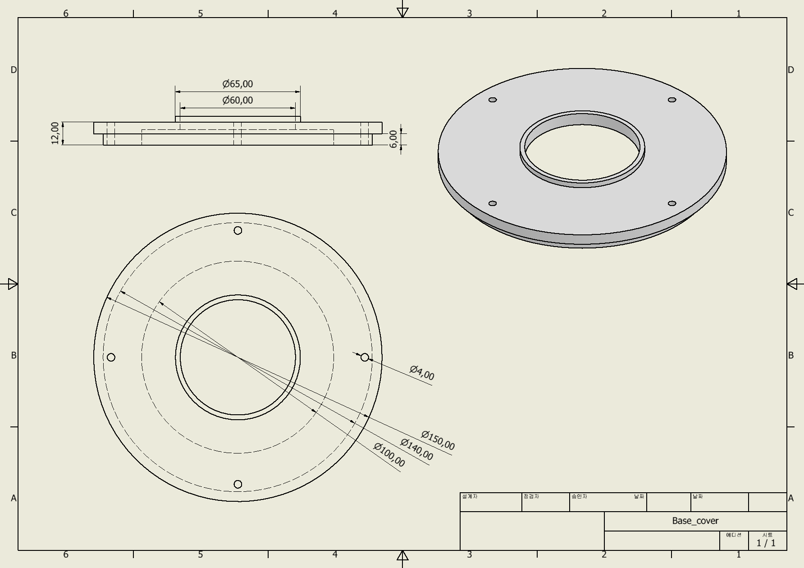
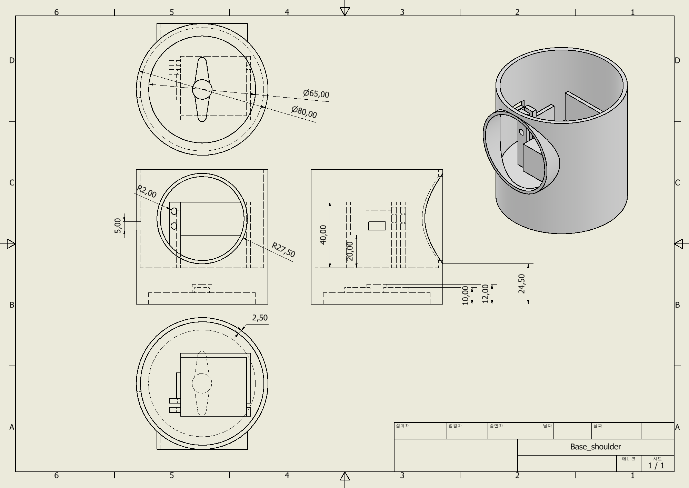
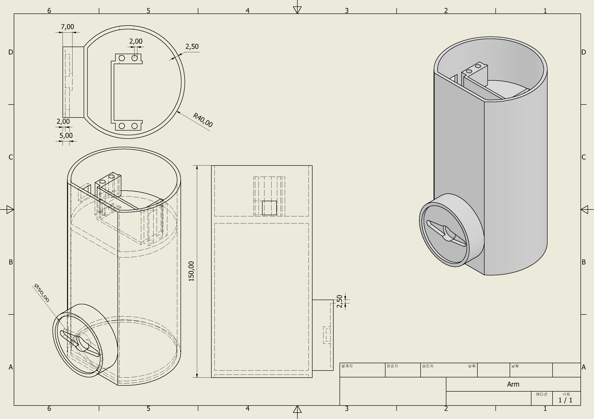
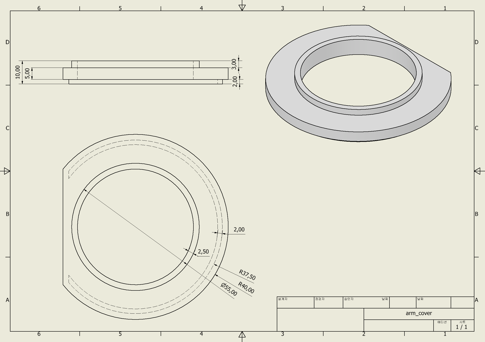
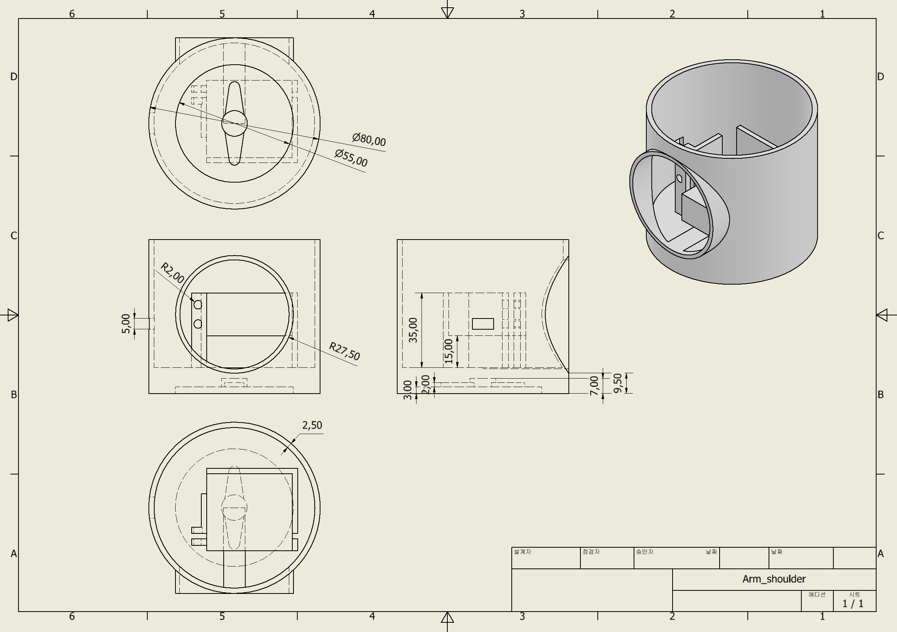
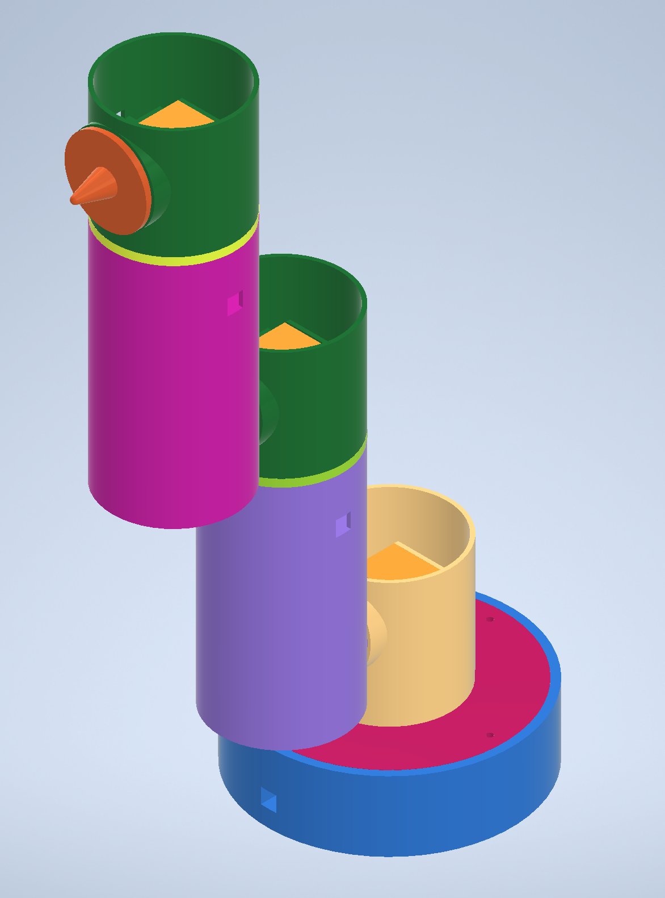
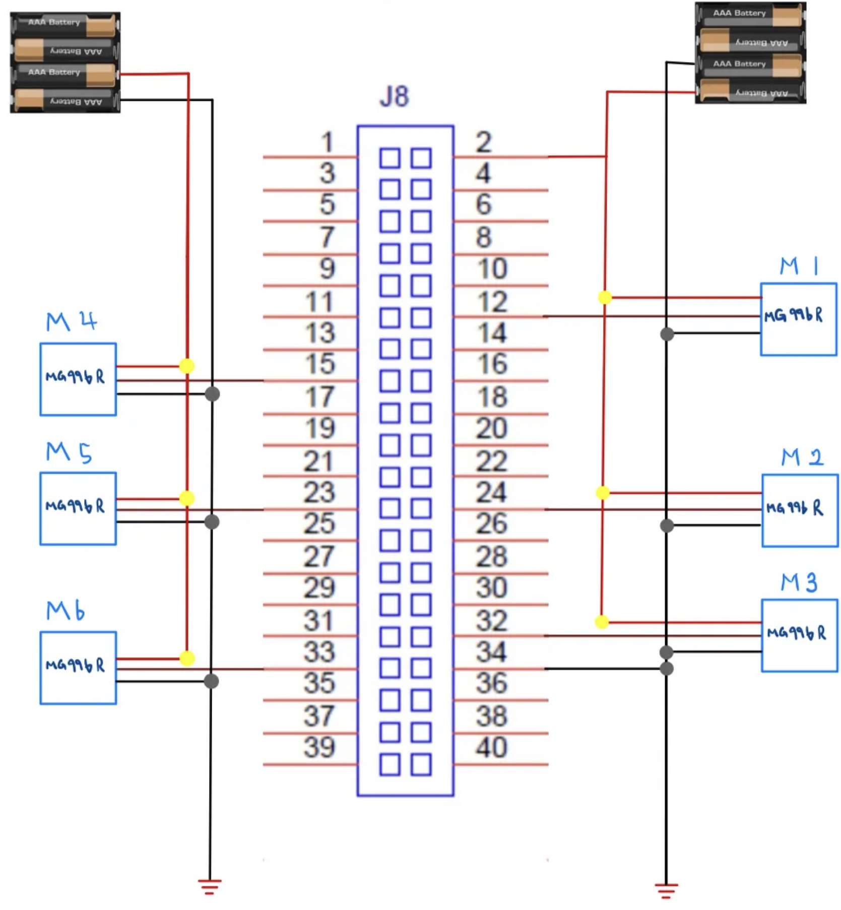

# 🤖 POOKY
### 프로젝트 진행 기간
2024.10.1(화)~2024.12.26(목)

## 🤗팀 멤버
|이름|역할|내용|
|:---:|:---:|:---|
|배세황[팀장]|설계| - Matlab을 이용 정기구학 및 역기구학 구현, 로봇의 운동 경로 계산 및 최적화 <br> - Inventor이용 다축 로봇 팔의 3D모델링, 구조적 안정성과 작동 범위 검증 <br> - 팀원 간의 원활한 협업을 위한 프로젝트 관리|
|강서연[팀원]|통신, 웹|- HTML과 CSS를 이용한 웹 인터페이스 구현, 사용자 친화적인 제어 환경 제공 <br> - Raspberry pi이용 통신 프로토콜 설계 및 로봇과의 데이터 송수신 구현 <br> - 시스템의 실시간 상태 모니터링 및 제어를 위한 로봇의 역학 데이터 웹페이지 적용|
|김창선[팀원]|제어|- Raspberry pi이용 회로설계 및 구성 <br> - 모터 선정 및 제어 알고리즘 설계, 로봇 팔의 동작 및 정확도 향상 <br> - 로봇 팔의 충돌 방지를 위한 안전 제어 알고리즘 구현|
|이세영[팀원]|설계, 통신|- Inventor이용 3D모델링, 로봇 팔 부품 설계 및 조립 시뮬레이션 <br> - Raspberry pi이용 통신 모듈 구현, 다축 로봇 팔의 네트워크 연동 <br> - 통신 장애를 최소화 하기 위한 데이터 전송 테스트 및 디버깅|

## 📟프로젝트 배경
현대 산업은 자동화 기술의 발전과 함께 효율성과 생산성을 극대화하기 위해 다축 로봇의 활용이 점점 중요해지고 있습니다. 이러한 흐름 속에서 우리는 다축 로봇에 대한 학습과 이해가 필수적임을 깨닫고, 이를 직접 설계하고 구현해보는 것을 목표로 프로젝트를 시작하게 되었습니다.

본 프로젝트는 설계, 제어, 프로그래밍 등 각기 다른 전공과 전문성을 가진 팀원들이 협력하여 다축 로봇 팔을 개발하는 것을 목표로 했습니다. 팀원들은 각자의 역량을 발휘하여 다축 로봇 팔의 설계와 제작을 진행하고, 제어 알고리즘을 통해 로봇 팔을 정밀하게 움직일 수 있도록 구현했습니다. 또한, 웹페이지와의 연동을 통해 사용자가 웹 환경에서 로봇 팔을 직관적으로 제어할 수 있는 시스템을 구축하고자 했습니다.

이 프로젝트를 통해 우리는 다축 로봇의 구조와 작동 원리를 깊이 이해하고, 실제 산업 현장에서 적용 가능한 자동화 기술을 경험하며, 각 분야의 역량을 융합하여 실질적인 결과물을 만들어내는 데 주력했습니다.

## ✨개요
- 'POOKY(푸키)'는 Rasberry pi를 기반으로 6개의 모터 연결하여 제작한 6축 로봇팔입니다. flask를 사용해 웹페이지를 통해 모터를 제어하고 기구학을 통해 구한 X, Y, Z, Rx, Ry, Rz를 사용자가 웹에서 확인할 수 있습니다.
- Inventor를 이용해 로봇팔 부품을 제작했습니다. 3D 모델링을 통해 각 부품을 제작하고 시뮬레이션을 통해 구동부에 문제점을 찾아 수정했습니다. 이후 3D프린터를 통해 제품을 뽑아 Raspberry pi와 모터와 함께 조립하여 6축로봇을 완성했습니다.

## 🎯타겟
- 로봇팔에 관심이 있는 입문자, 초보자 초보자를 위한 가이드 제작

## 개발환경
- 설계
<div>
 
</div>

- 제어
<div>
 
</div>

- 임베디드


- 개발언어


## 설계

### CAD

Inventor를 사용해 6축로봇 부품 모델링
|1. Base_bottom|2. Base_cover|3. Base_shoulder|
| --- | --- | --- |
| | | | 

|4. Arm|5. Arm_cover|6. Arm_shoudler|7. End_effector|
| --- | --- | --- | --- |
| | | | |

|조립된 모습|
| --- |
||

### DH Parameter
모터의 회전축을 Z축으로 기준 삼아 Modified DH Parameter를 계산

```python

    # DH 파라미터 설정 [theta(z), d(z), a(x), alpha(x)]
    # 각도 : rad, 길이 : m    
    DH_parameters = [
        [joint_angles[0],            0.056,         0,         0],
        [joint_angles[1],            0.042,      0.03,  -np.pi/2],
        [joint_angles[2]-np.pi/2,   0.0412,      0.13,  -np.pi/2],
        [joint_angles[3],           0.0309,     0.032,   np.pi/2],
        [joint_angles[4],           0.0412,      0.13,   np.pi/2],
        [joint_angles[5],           0.0612,     0.032,         0]
    ]

```

## 제어

### Rasberry pi



```Python
# 모터 제어 코드
from flask import Flask, request
import RPi.GPIO as GPIO
import time
import forward

app = Flask(__name__)

# GPIO 핀 설정
MOTOR_PINS = {
    "base": 18,       # GPIO 18번 핀
    "shoulder": 8,    # GPIO 8번 핀
    "elbow": 12,      # GPIO 12번 핀
    "wrist1": 22,     # GPIO 22번 핀
    "wrist2": 11,     # GPIO 11번 핀
    "wrist3": 13      # GPIO 13번 핀
}

GPIO.setmode(GPIO.BCM)
for pin in MOTOR_PINS.values():
    GPIO.setup(pin, GPIO.OUT)

# PWM 설정 (50Hz)
pwm = {motor: GPIO.PWM(pin, 50) for motor, pin in MOTOR_PINS.items()}
for motor_pwm in pwm.values():
    motor_pwm.start(0)

# 현재 각도 추적 변수
current_angles = {motor: 0 for motor in MOTOR_PINS.keys()}  # 초기 각도는 0으로 설정

# 각도 설정 함수
def set_angle(motor, angle):
    """
    입력된 각도 (-180 ~ 180)를 서보 모터로 이동.
    이동 방향은 현재 각도와 목표 각도를 비교하여 결정.
    """
    if angle < -90 or angle > 90:
        raise ValueError("Angle out of bounds! Must be between -90 and 90.")

    # 현재 각도 가져오기
    current_angle = current_angles[motor]

    # 이동 방향 계산
    if current_angle < angle:  # 목표 각도가 더 크면
        if current_angle < 0 and angle < 0:  # 둘 다 음수일 경우
            direction = "clockwise" if abs(current_angle) < abs(angle) else "counterclockwise"
        else:  # 일반적으로 목표 각도가 더 크면 시계 방향
            direction = "clockwise"
    else:  # 목표 각도가 더 작으면
        if current_angle > 0 and angle > 0:  # 둘 다 양수일 경우
            direction = "counterclockwise" if current_angle > angle else "clockwise"
        else:  # 일반적으로 목표 각도가 더 작으면 반시계 방향
            direction = "counterclockwise"

    # 이동 방향 출력
    print(f"Moving {motor} {direction} from {current_angle}° to {angle}°.")

    # -180 ~ 180 범위를 0 ~ 180로 변환
    converted_angle = 90 + angle  # -180 ~ 180 -> 0 ~ 180
    duty_cycle = 2.5 + (converted_angle / 18)  # Duty Cycle 계산

    # GPIO 제어
    pin = MOTOR_PINS[motor]
    GPIO.output(pin, True)
    pwm[motor].ChangeDutyCycle(duty_cycle)
    time.sleep(1)
    GPIO.output(pin, False)
    pwm[motor].ChangeDutyCycle(0)

    # 현재 각도를 업데이트
    current_angles[motor] = angle

@app.route("/control", methods=["POST"])
def control():
    data = request.get_json()
    motor = data.get("motor", None)  # 모터 ID 가져오기
    angle = data.get("angle", None)  # 각도 값 가져오기

    if motor not in MOTOR_PINS:
        return "Invalid motor! Must be one of the valid motors.", 400

    if angle is not None and -90 <= angle <= 90:
        try:
            set_angle(motor, angle)
            return f"Moved {motor} to {angle} degrees!", 200
        except ValueError as e:
            return str(e), 400
    else:
        return "Invalid angle! Must be between -180 and 180.", 400

if __name__ == "__main__":
    try:
        app.run(host="0.0.0.0", port=5000)
    except KeyboardInterrupt:
        for motor_pwm in pwm.values():
            motor_pwm.stop()
        GPIO.cleanup()

```

### 정기구학 & 역기구학

```python
import numpy as np
# 정기구학
def forward(joint_angles):

    # 조인트 각도를 라디안 단위로 변환
    joint_angles = np.radians(joint_angles)

    # DH 파라미터 설정 [theta(z), d(z), a(x), alpha(x)]
    # 각도 : rad, 길이 : m   
    DH_parameters = [
        [joint_angles[0],            0.056,         0,         0],
        [joint_angles[1],            0.042,      0.03,  -np.pi/2],
        [joint_angles[2]-np.pi/2,   0.0412,      0.13,  -np.pi/2],
        [joint_angles[3],           0.0309,     0.032,   np.pi/2],
        [joint_angles[4],           0.0412,      0.13,   np.pi/2],
        [joint_angles[5],           0.0612,     0.032,         0]
    ]
    
    # 초기 변환 행렬(4x4 단위 행렬)
    final_matrix = np.eye(4)

    # 각 링크에 대해 변환 행렬 계산
    for params in DH_parameters:
        theta, d, a, alpha = params  # DH 파라미터에서 값 추출
        
        # 변환 행렬 생성 rot(Z) > trans(Z) > trans(X) > rot(X)
        T = np.array([
            [np.cos(theta), -np.sin(theta)*np.cos(alpha),  np.sin(theta)*np.sin(alpha), a*np.cos(theta)],
            [np.sin(theta),  np.cos(theta)*np.cos(alpha), -np.cos(theta)*np.sin(alpha), a*np.sin(theta)],
            [0,              np.sin(alpha),               np.cos(alpha),              d],
            [0,              0,                           0,                          1]
        ])
        
        # 이전 변환 행렬과 현재 변환 행렬을 곱하여 누적
        final_matrix = np.dot(final_matrix, T)

    # 최종 변환 행렬에서 위치 값 추출
    x = final_matrix[0, 3]
    y = final_matrix[1, 3]
    z = final_matrix[2, 3]

    # 최종 변환 행렬에서 ZYX 오일러 각도 계산
    rz = np.arctan2(final_matrix[1, 0], final_matrix[0, 0])  # Z축 회전
    ry = np.arctan2(-final_matrix[2, 0], np.sqrt(final_matrix[2, 1]**2 + final_matrix[2, 2]**2))  # Y축 회전
    rx = np.arctan2(final_matrix[2, 1], final_matrix[2, 2])  # X축 회전

    # 라디안을 도 단위로 변환
    rx = np.degrees(rx)
    ry = np.degrees(ry)
    rz = np.degrees(rz)

    # 최종 위치와 오일러 각도를 반환
    return x, y, z, rx, ry, rz

# 예제 입력: 조인트 각도 리스트 (단위: 도)
# joint_angles = [57.25147, -48.33403189, 69.0253068, 34.5098, 72.7, 25.8967]
joint_angles = [0, 0, 0, 0, 0, 0]

# 함수 호출
x, y, z, rx, ry, rz = forward(joint_angles)

# 결과 출력
print(f"위치: x = {x:.3f}, y = {y:.3f}, z = {z:.3f}")
print(f"오일러 각도: rx = {rx:.3f}°, ry = {ry:.3f}°, rz = {rz:.3f}°")

```

```python
# 역기구학
import numpy as np
from numpy import deg2rad, rad2deg
from sympy import symbols, sin, cos, atan2, acos, Matrix

# 계산오차를 무시하기 위한 함수
def custom_zero(value, tolerance=1e-6):
    return 0 if abs(value) < tolerance else value

# 변환 행렬 생성 rot(Z) > trans(Z) > trans(X) > rot(X)
def dh_transform(theta, d, a, alpha):
    return np.array([
        [np.cos(theta), -np.sin(theta)*np.cos(alpha),  np.sin(theta)*np.sin(alpha), a*np.cos(theta)],
        [np.sin(theta),  np.cos(theta)*np.cos(alpha), -np.cos(theta)*np.sin(alpha), a*np.sin(theta)],
        [0,              np.sin(alpha),               np.cos(alpha),              d],
        [0,              0,                           0,                          1]
    ])

tolerance = 1e-6

# target값 단위[위치 : mm, 각도 : 도]
x_p, y_p, z_p = 1244, 0, 950
roll, pitch, yaw = deg2rad(0), deg2rad(90), deg2rad(0)

# DH 파라미터 설정 [theta(z), d(z), a(x), alpha(x)]
# 각도 : rad, 길이 : m 
DH_parameters = [
    [joint_angles[0],            0.056,         0,         0],
    [joint_angles[1],            0.042,      0.03,  -np.pi/2],
    [joint_angles[2]-np.pi/2,   0.0412,      0.13,  -np.pi/2],
    [joint_angles[3],           0.0309,     0.032,   np.pi/2],
    [joint_angles[4],           0.0412,      0.13,   np.pi/2],
    [joint_angles[5],           0.0612,     0.032,         0]
]

# target matrix 생성
loc = np.array([
    [1, 0, 0, x_p/1000],
    [0, 1, 0, y_p/1000],
    [0, 0, 1, z_p/1000],
    [0, 0, 0, 1]
])

rot_z = np.array([
    [np.cos(roll), -np.sin(roll), 0, 0],
    [np.sin(roll),  np.cos(roll), 0, 0],
    [0,             0,            1, 0],
    [0,             0,            0, 1]
])

rot_y = np.array([
    [np.cos(pitch),  0, np.sin(pitch), 0],
    [0,              1, 0,             0],
    [-np.sin(pitch), 0, np.cos(pitch), 0],
    [0,              0, 0,             1]
])

rot_x = np.array([
    [1,  0,           0,          0],
    [0,  np.cos(yaw), -np.sin(yaw), 0],
    [0,  np.sin(yaw),  np.cos(yaw), 0],
    [0,  0,           0,          1]
])

zyx_rot = rot_z @ rot_y @ rot_x

# joint 1~3 계산
trans625 = loc @ zyx_rot @ np.array([0, 0, -DH_parameters[5][1], 1])

deg1_1 = rad2deg(float(atan2(trans625[1], trans625[0])))
h_1 = np.sqrt(trans625[0]**2 + trans625[1]**2) - DH_parameters[0][2]
h_2 = trans625[2]
h_0 = np.sqrt(h_1**2 + h_2**2)

B_1 = rad2deg(float(atan2(h_2, h_1)))
B_2 = rad2deg(float(acos((h_0**2 + DH_parameters[1][2]**2 - DH_parameters[3][1]**2) / (2 * h_0 * DH_parameters[1][2]))))
r_1 = rad2deg(float(acos((DH_parameters[1][2]**2 + DH_parameters[3][1]**2 - h_0**2) / (2 * DH_parameters[1][2] * DH_parameters[3][1]))))

deg2_2 = 90 - B_1 - B_2
deg3_3 = 180 - r_1

# DH parameters에 joint 1~3 업데이트
DH_parameters[0][0] = deg2rad(deg1_1)
DH_parameters[1][0] = deg2rad(deg2_2 - 90)
DH_parameters[2][0] = deg2rad(deg3_3 - 90)

# joint 1-3 까지 정기구학
final_matrix_13 = np.eye(4)
for i in range(3):
    final_matrix_13 = final_matrix_13 @ dh_transform(*DH_parameters[i])

# joint 4-6 까지 역기구학
final_matrix_46 = np.eye(4)
for i in range(3, 6):
    final_matrix_46 = final_matrix_46 @ dh_transform(*DH_parameters[i])

rot_36 = np.linalg.inv(final_matrix_13[:3, :3]) @ zyx_rot[:3, :3]
rot_36_clean = np.vectorize(lambda x: custom_zero(x, tolerance))(rot_36)

# joint 4~6 계산
deg4_4 = rad2deg(float(atan2(rot_36_clean[1, 2], rot_36_clean[0, 2])))
deg5_5 = rad2deg(float(acos(rot_36_clean[2, 2])))
deg6_6 = rad2deg(float(atan2(rot_36_clean[2, 1], -rot_36_clean[2, 0])))

# 최종 joint 값
deg = [deg1_1, deg2_2, deg3_3, deg4_4, deg5_5, deg6_6]
print("Joint Angles (degrees):", deg)

```

## 웹

### Python
```python

from flask import Flask, render_template, request, jsonify
import numpy as np
import requests
from forward import forward  # forward.py의 forward 함수 import
from inverse import calculate_angles  # inverse.py의 calculate_angles 함수 import

app = Flask(__name__)

@app.route("/")
def index():
    return render_template("index.html")

@app.route('/forward', methods=['POST'])
def forward_kinematics():
    data = request.json
    joint_angles = np.radians(data['joint_angles'])
    DH_parameters = [
    [joint_angles[0],            0.056,         0,         0],
    [joint_angles[1],            0.042,      0.03,  -np.pi/2],
    [joint_angles[2]-np.pi/2,   0.0412,      0.13,  -np.pi/2],
    [joint_angles[3],           0.0309,     0.032,   np.pi/2],
    [joint_angles[4],           0.0412,      0.13,   np.pi/2],
    [joint_angles[5],           0.0612,     0.032,         0]
]

    final_matrix = np.eye(4)
    for params in DH_parameters:
        theta, d, a, alpha = params
        T = np.array([
            [np.cos(theta), -np.sin(theta)*np.cos(alpha), np.sin(theta)*np.sin(alpha), a*np.cos(theta)],
            [np.sin(theta), np.cos(theta)*np.cos(alpha), -np.cos(theta)*np.sin(alpha), a*np.sin(theta)],
            [0, np.sin(alpha), np.cos(alpha), d],
            [0, 0, 0, 1]
        ])
        final_matrix = np.dot(final_matrix, T)

    x = final_matrix[0, 3]
    y = final_matrix[1, 3]
    z = final_matrix[2, 3]
    rz = np.arctan2(final_matrix[1, 0], final_matrix[0, 0])
    ry = np.arctan2(-final_matrix[2, 0], np.sqrt(final_matrix[2, 1]**2 + final_matrix[2, 2]**2))
    rx = np.arctan2(final_matrix[2, 1], final_matrix[2, 2])

    return jsonify({
        'x': x,
        'y': y,
        'z': z,
        'rx': np.degrees(rx),
        'ry': np.degrees(ry),
        'rz': np.degrees(rz)
    })

if __name__ == '__main__':
    app.run(debug=True)

```

### HTML

```HTML

<!DOCTYPE html>
<html lang="en">
<head>
    <meta charset="UTF-8">
    <meta name="viewport" content="width=device-width, initial-scale=1.0">
    <title>MG996r Servo Motor Control</title>
    <script src="https://cdn.jsdelivr.net/pyodide/v0.23.0/full/pyodide.js"></script>
    <style>
        body {
            font-family: Arial, sans-serif;
            background-color: #f9f9f9;
            margin: 0;
            padding: 0;
        }
        .container {
            max-width: 1200px;
            margin: 0 auto;
            padding: 20px;
        }
        .row {
            display: flex;
            flex-wrap: wrap;
            gap: 20px;
        }
        .col {
            flex: 1;
            min-width: 300px;
            background-color: #ffffff;
            border: 1px solid #ddd;
            border-radius: 8px;
            padding: 20px;
            box-shadow: 0 2px 4px rgba(0, 0, 0, 0.1);
        }
        .motor-control {
            margin-bottom: 20px;
        }
        .motor-control h3 {
            margin-top: 0;
        }
        label {
            font-weight: bold;
        }
        input[type="number"] {
            width: 100%;
            padding: 8px;
            margin-top: 5px;
            margin-bottom: 15px;
            border: 1px solid #ccc;
            border-radius: 4px;
        }
        .result {
            background-color: #f1f1f1;
            border-radius: 8px;
            padding: 15px;
        }
    </style>
</head>
<body>
    <div class="container">
        <h1>MG996r Servo Motor Control</h1>
        <div class="row">
            <div class="col">
                <div id="motor-controls">
                    <div class="motor-control">
                        <h3>Base</h3>
                        <label>Angle:</label>
                        <input type="number" id="motor-base" min="-90" max="90" value="0" onchange="calculateForwardKinematics()" />
                    </div>
                    <div class="motor-control">
                        <h3>Shoulder</h3>
                        <label>Angle:</label>
                        <input type="number" id="motor-shoulder" min="-90" max="90" value="0" onchange="calculateForwardKinematics()" />
                    </div>
                    <div class="motor-control">
                        <h3>Elbow</h3>
                        <label>Angle:</label>
                        <input type="number" id="motor-elbow" min="-90" max="90" value="0" onchange="calculateForwardKinematics()" />
                    </div>
                    <div class="motor-control">
                        <h3>Wrist 1</h3>
                        <label>Angle:</label>
                        <input type="number" id="motor-wrist1" min="-90" max="90" value="0" onchange="calculateForwardKinematics()" />
                    </div>
                    <div class="motor-control">
                        <h3>Wrist 2</h3>
                        <label>Angle:</label>
                        <input type="number" id="motor-wrist2" min="-90" max="90" value="0" onchange="calculateForwardKinematics()" />
                    </div>
                    <div class="motor-control">
                        <h3>Wrist 3</h3>
                        <label>Angle:</label>
                        <input type="number" id="motor-wrist3" min="-90" max="90" value="0" onchange="calculateForwardKinematics()" />
                    </div>
                </div>
            </div>
            <div class="col">
                <div class="result" id="result">
                    <h3>Result:</h3>
                    <p id="position">Position: x = 0, y = 0, z = 0</p>
                    <p id="euler">Euler Angles: rx = 0°, ry = 0°, rz = 0°</p>
                </div>
            </div>
        </div>
    </div>

    <script>
        let pyodideReady = false;
        let pyodide;

        // Pyodide 초기화
        async function initPyodide() {
            pyodide = await loadPyodide();
            await pyodide.loadPackage('numpy');
            pyodideReady = true;
            console.log('Pyodide loaded');
        }

        initPyodide();

        // Python 코드를 실행하여 Forward Kinematics 계산
        async function calculatePythonFK(jointAngles) {
            if (!pyodideReady) {
                console.error('Pyodide is not ready');
                return;
            }

            const pythonCode = `
import numpy as np

def forward(joint_angles):
    joint_angles = np.radians(joint_angles)
    DH_parameters = [
        [joint_angles[0], 0.056, 0, 0],
        [joint_angles[1], 0.042, 0.03, -np.pi/2],
        [joint_angles[2]-np.pi/2, 0.0412, 0.13, -np.pi/2],
        [joint_angles[3], 0.0309, 0.032, np.pi/2],
        [joint_angles[4], 0.0412, 0.13, np.pi/2],
        [joint_angles[5], 0.0612, 0.032, 0]
    ]

    final_matrix = np.eye(4)
    for params in DH_parameters:
        theta, d, a, alpha = params
        T = np.array([
            [np.cos(theta), -np.sin(theta)*np.cos(alpha), np.sin(theta)*np.sin(alpha), a*np.cos(theta)],
            [np.sin(theta), np.cos(theta)*np.cos(alpha), -np.cos(theta)*np.sin(alpha), a*np.sin(theta)],
            [0, np.sin(alpha), np.cos(alpha), d],
            [0, 0, 0, 1]
        ])
        final_matrix = np.dot(final_matrix, T)

    x = final_matrix[0, 3]
    y = final_matrix[1, 3]
    z = final_matrix[2, 3]
    rz = np.arctan2(final_matrix[1, 0], final_matrix[0, 0])
    ry = np.arctan2(-final_matrix[2, 0], np.sqrt(final_matrix[2, 1]**2 + final_matrix[2, 2]**2))
    rx = np.arctan2(final_matrix[2, 1], final_matrix[2, 2])
    return x, y, z, np.degrees(rx), np.degrees(ry), np.degrees(rz)

joint_angles = ${JSON.stringify(jointAngles)}
x, y, z, rx, ry, rz = forward(joint_angles)
(x, y, z, rx, ry, rz)
`;

            return await pyodide.runPythonAsync(pythonCode);
        }

        // HTML 업데이트
        async function calculateForwardKinematics() {
            const angles = [
                parseFloat(document.getElementById('motor-base').value),
                parseFloat(document.getElementById('motor-shoulder').value),
                parseFloat(document.getElementById('motor-elbow').value),
                parseFloat(document.getElementById('motor-wrist1').value),
                parseFloat(document.getElementById('motor-wrist2').value),
                parseFloat(document.getElementById('motor-wrist3').value),
            ];

            try {
                const [x, y, z, rx, ry, rz] = await calculatePythonFK(angles);
                document.getElementById('position').textContent = `Position: x = ${x.toFixed(3)}, y = ${y.toFixed(3)}, z = ${z.toFixed(3)}`;
                document.getElementById('euler').textContent = `Euler Angles: rx = ${rx.toFixed(3)}°, ry = ${ry.toFixed(3)}°, rz = ${rz.toFixed(3)}°`;
            } catch (error) {
                console.error('Error calculating FK:', error);
            }
        }
    </script>
</body>
</html>

```

## 6축로봇 제작
